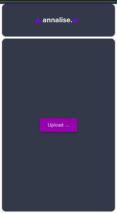

# About the Project
This project is about building a small Electron React desktop app which will be used to upload the image and view it.

The project is composed by 2 parts: React App and Electron App. 

Let's start it one by one.

## Prerequest
Before start the project,the following things are needed installed in your local machine

### nodeJs
Go to the following URL to install it

[NodeJs Install](https://nodejs.org/en/download/)

### Yarn
Go to the following URL to install it

[Yarn Install](https://classic.yarnpkg.com/en/docs/install/#mac-stable)


## Start the project
Let's first start the project with development version. You may need following serval steps:

#### 1. Donwload the project
First you need download the project from the github

```
git clone https://github.com/jingwangian/xray.git xray
```

#### 2. Init the packages
Go to the xray directory and run command

```
yarn 
```
This is used to download necessary packages and install them in the node_modules.

#### 3. start the project
```
yarn start
```
By this way you can simply start the desktop app.
This step acctually includes 2 sub steps:


## Details in the project
The project is composed by 2 parts:

### React App
The React part is used to build a webpage app as following:



You can start the react app by invoke `yarn react-start` command.

##### The following are all commands related with the react app, you can find them in the package.json file

* `yarn react-start` --- start the react webpage app

* `yarn react-build` --- build react app and save it into the build

* `yarn react-test` --- test the react webpage app

The src and public contains the react app code.

### Electron
The electron is used to package the react webpage app into a desktop app. So you can install it as a desktop app and run it in local machine.

There is a electron.js file in the `public` directory which is used to build the desktop app.

#### Start the electron app
```
yarn start
```
This is only used to start a dev version app and not build it. You can easily see the log in the terminal and debug it.


#### Build the final version
```
yarn build
```
The command will build the react app firstly and then build the electron app. The build result is save into the dist directory.

